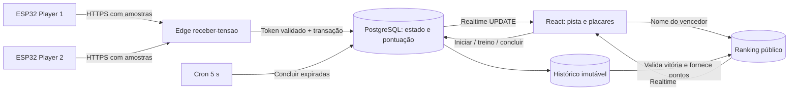

# Voltage Run · Arena CONEP

Jogo de corrida para dois jogadores com **ESP32 + Supabase + React**. Pisadas frequentes e tensões de pico maiores fazem o corredor avançar mais. Uma corrida oficial dura **60 segundos**; o vencedor pode registrar seu nome no ranking mundial. A cidade e os corredores têm visual neon inspirado na referência fornecida, com animação por sprites e interface responsiva.

O backend é real: pontuação, vencedor, histórico e ranking são calculados e persistidos no Supabase. O ESP32 só coleta tensão e envia HTTPS. O navegador recebe atualizações por WebSocket, sem polling de estado.

## Abrir e jogar

O projeto está vinculado a `aubsybidmyfzkyflthkf`. As migrations foram aplicadas, `receber-tensao` foi publicada e o cron de encerramento está ativo. `.env.local`, ignorado pelo Git, contém a URL e a chave **pública** fornecidas. Nenhuma chave administrativa foi gravada no código.

```powershell
npm ci
npm run dev
```

Abra **http://127.0.0.1:5173** e entre com uma conta desse Supabase. Se ainda não tiver conta, o responsável cria uma em **Authentication → Users → Add user → Create new user**, com e-mail e senha. O aplicativo usa login por senha e não oferece cadastro público. Não é necessário enviar convite nem configurar SMTP para uma conta criada diretamente pelo responsável.

1. Preencha **Nome da arena** e clique em **Criar arena**.
2. Para jogar imediatamente sem sensores, escolha **Treino no teclado → Iniciar corrida**.
3. Aguarde a contagem de 3 segundos. Player 1 usa **A** (leve) e **S** (forte); Player 2 usa **K** (leve) e **L** (forte). No celular, toque nos botões.
4. Solte e pressione novamente para cada pisada. Segurar a tecla não dispara repetidamente.
5. Para uma corrida oficial, abra **Configurar ESP32**, gere os dois tokens, configure as placas e escolha **Usar ESP32 · oficial**.
6. No fim, o vencedor informa seu nome e clica em **Entrar no ranking**. O nome será público. Também é possível abrir uma vitória anterior pelo histórico.

O treino exercita a mesma regra no servidor, mas **não entra no ranking**. A corrida oficial exige tokens configurados para os dois jogadores. O painel não inventa conectividade dos sensores: o indicador Realtime se refere ao navegador; os horários de atualização mostram a atividade de cada ESP32.

## Regras v1 — 60 segundos

| Regra | Comportamento |
| --- | --- |
| Largada | Contagem de 3 s, seguida de 60 s de corrida. |
| Pisada | Parte do sensor liberado (≤ 0,25 V), ultrapassa 0,60 V e volta a ≤ 0,25 V. |
| Duração do pulso | Entre 20 e 1.500 ms. Pressão mantida não pontua. |
| Intervalo mínimo | 200 ms entre liberações válidas; filtra repiques. |
| Força | Usa o maior valor medido durante a pisada, limitado a 3,3 V para pontuar. |
| Ritmo | Pisadas por segundo, a partir do intervalo entre as duas últimas pisadas. Após 2 s sem passos, o bônus reinicia. |
| Distância | De 1 a 4 m de base por pisada, multiplicados por um bônus de ritmo de até 1,5×. |
| Pontos | 10 pontos por metro completo em décimos; arredondamento para baixo. |
| Vitória | Maior distância acumulada ao fim dos 60 s. Empate não gera inscrição. |
| Interrupção | Salva resultado parcial sem vencedor elegível. Corridas não podem ser pausadas. |

Fórmula executada no PostgreSQL, com distância interna em centímetros:

```text
ritmo = min(5, 1000 / intervalo_ms)   # zero no primeiro passo ou após pausa > 2 s
bônus = 1 + min(0,5; max(0; (ritmo - 1) × 0,2))
ganho_cm = arredondar((100 + 300 × min(pico_V; 3,3) / 3,3) × bônus)
distância_cm += ganho_cm
pontos = piso(distância_cm / 10)
```

Exemplo: uma primeira pisada com pico de **3,3 V** avança **4 m / 40 pontos**; com **1,5 V**, avança **2,36 m / 23 pontos**. Repetir as pisadas rapidamente aumenta o número de passos e pode ativar o bônus. A tensão é uma aproximação da força do sensor, não uma medição calibrada em newtons. Os dois circuitos devem ter resposta semelhante para uma disputa justa.

Há uma tolerância de **2 s** após o fim para os lotes em trânsito. Somente amostras com timestamp dentro da corrida contam. O navegador pode solicitar a conclusão depois desse prazo; um **cron a cada 5 s** encerra também as corridas sem navegador ou ESP32 conectado. A apuração pode aparecer alguns segundos depois do zero.

## Arquitetura e arquivos



| Arquivo ou diretório | Responsabilidade |
| --- | --- |
| `frontend/src/App.tsx` | Sessão, arenas, rota `/testes/:id` e ranking público `/ranking`. |
| `frontend/src/components/TestMonitor.tsx` | Largada, modos, teclado, resultado e interrupção. |
| `RaceStage.tsx`, `WinnerForm.tsx`, `Leaderboard.tsx` | Pista, inscrição da vitória e classificação real. |
| `frontend/src/hooks/useTeste.ts` | Snapshot inicial, Realtime, reconexão e ordenação por revisão. |
| `frontend/src/hooks/useGameClock.ts` | Relógio local sincronizado com o servidor, sem consultas periódicas. |
| `frontend/src/game.css`, `frontend/public/game/` | Visual neon, animações, cidade e sprites. |
| `supabase/migrations/20260910151138_monitoramento_tensao.sql` | Base de arenas, histórico, autorização e dispositivos. |
| `supabase/migrations/20260911020407_voltage_run_game.sql` | Regras do jogo, modos, classificação e cron. |
| `supabase/functions/receber-tensao/` | Validação HTTP, hash de token, RPC e testes Deno. |
| `supabase/tests/monitoramento.sql` | Testes transacionais de pontuação, RLS e integridade. |
| `esp32/sketch.ino`, `certificados.h`, `diagram.json` | Firmware Arduino, CAs públicas e circuito Wokwi. |
| `tests/monitoramento.spec.ts` | Corrida completa com navegador, Edge e Supabase reais. |

### Persistência e concorrência

- `public.testes`: estado atual, JSONs dos players, proprietário, revisão, modo e horários da corrida.
- `public.rodadas`: snapshot dos dois players e do resultado, único por arena/número.
- `public.ranking_mundial`: uma entrada por vitória oficial, com nome, player, distância, pontos e pisadas.
- `public.teste_participantes`: usuários autorizados a acompanhar uma arena.
- `private.dispositivos`: hash do token de cada arena/player.
- `private.sinais`: estado de detecção de pulso, sem exposição ao navegador.

Envio, largada, interrupção, conclusão e troca de token usam o lock da arena. O snapshot e o avanço do número da rodada acontecem na mesma transação. Concluir novamente uma corrida encerrada é idempotente. Uma largada com número de rodada antigo recebe 409. Novas corridas zeram os campos do jogo e preservam outras propriedades JSON; os resultados concluídos permanecem no histórico.

O ranking recebe **somente o nome e a ID da rodada** do cliente. Pontos, distância e player vencedor vêm do snapshot validado no servidor. Repetir o mesmo nome é idempotente; tentar trocar o nome de uma inscrição existente recebe 409. A ordenação usa distância decrescente e, em empate, registro mais antigo. São exibidos os 100 primeiros. As regras estão versionadas como `v1-60s`.

O proprietário da arena representa o console compartilhado dos dois jogadores: é ele quem permite ao vencedor escrever o nome. Não há contas individuais obrigatórias para cada corredor. Os tokens restringem o dispositivo, mas não comprovam fisicamente uma pisada; o operador que conhece um token ainda pode simular leituras HTTP. Isso não constitui um sistema antifraude com atestação de hardware.

### Realtime

O navegador faz o primeiro `SELECT` e assina:

```ts
{ event: 'UPDATE', schema: 'public', table: 'testes', filter: `id=eq.${id}` }
```

Ao conectar/reconectar, voltar à aba ou recuperar internet, recupera o snapshot. A revisão evita que respostas antigas substituam dados novos. Respostas das próprias ações também atualizam o painel com o estado confirmado pelo servidor. O histórico só é consultado ao conectar e mudar a rodada. O ranking recebe sua própria subscription. Canais são removidos ao sair da página.

O timer de 100 ms serve apenas à animação do relógio local. Não há polling de dados. O banco guarda o estado agregado, não todas as amostras históricas.

## Segurança e painel Supabase

O frontend usa apenas `VITE_SUPABASE_URL` e `VITE_SUPABASE_PUBLISHABLE_KEY`. A configuração recusa uma secret key ou JWT `service_role`. O ESP32 usa `X-Device-Token`, próprio da arena/player. Somente a Edge Function usa `SUPABASE_SERVICE_ROLE_KEY`, provisionada pelo Supabase em seu ambiente de servidor.

Todas as tabelas têm RLS. Arenas e histórico exigem login e propriedade/participação. Clientes não podem editar pontos, criar snapshots nem inserir diretamente no ranking. Apenas a leitura do ranking é pública. Funções privilegiadas ficam em `private`, com `search_path` fixo e verificação de usuário/proprietário; wrappers públicos usam `SECURITY INVOKER` e grants explícitos.

`receber-tensao` usa `verify_jwt = false` porque autentica com o token específico do dispositivo, validado atomicamente no banco. Token incorreto ou ausente retorna 401. A publishable key não substitui o token. Gerar outro token revoga o anterior daquele jogador; copie-o antes de sair da página, pois só o hash fica persistido.

No painel, mantenha:

1. Login por e-mail/senha habilitado, com uma conta para o responsável.
2. Schema `public` exposto na Data API; `private` não exposto.
3. `testes` e `ranking_mundial` na publicação `supabase_realtime` — as migrations fazem isso.
4. Função `receber-tensao` ativa e tarefa Cron `conep_voltage_run_expirar_v1` ativa.

Para compartilhar uma arena com um visualizador já cadastrado, o administrador executa:

```sql
insert into public.teste_participantes(teste_id,user_id)
values ('UUID_DA_ARENA','UUID_DO_USUARIO_AUTH') on conflict do nothing;
```

Ele poderá abrir `/testes/UUID_DA_ARENA` com seu login, mas não controlar a corrida ou registrar nomes. `/ranking` é aberto sem login.

## Configurar outro Supabase / publicar atualizações

Requisitos: Node.js 22.12+ ou 24+, npm e acesso administrativo ao projeto. Docker só é necessário para uma stack Supabase local.

```powershell
npm ci
npx supabase login
npx supabase link --project-ref SEU_PROJECT_REF
npx supabase db push
npx supabase functions deploy receber-tensao --project-ref SEU_PROJECT_REF --use-api
```

`db push` aplica apenas migrations pendentes. Não reaplique SQL de migrations já registradas nem use `db reset` remoto. Se usar o SQL Editor, execute as migrations em ordem e registre as versões aplicadas com `supabase migration repair` antes de continuar pelo CLI. O projeto anterior `responsible_profiles` e suas funções foram preservados.

Copie `.env.example` para `.env.local` **na raiz**, preenchendo:

```dotenv
VITE_SUPABASE_URL=https://SEU_PROJETO.supabase.co
VITE_SUPABASE_PUBLISHABLE_KEY=sb_publishable_SUBSTITUA
```

O Vite usa `envDir: '..'`. Reinicie o servidor após alterar o arquivo. Nunca use prefixo `VITE_` em secrets administrativos: essas variáveis entram no bundle público.

```powershell
npm run dev
npm run build
npm run preview --workspace frontend
```

O build fica em `frontend/dist`. Para acesso pela internet, publique essa pasta em uma hospedagem estática com fallback de `/testes/*` e `/ranking` para `/index.html`. `_redirects` está incluído para provedores compatíveis. **O backend e o ranking estão no Supabase; o frontend desta entrega roda localmente e ainda precisa de hospedagem para ter uma URL pública.** Não há resultados fictícios pré-carregados.

### Railway

O repositório inclui `railway.json` e `server.mjs`. No Railway, configure as variáveis `VITE_SUPABASE_URL` e `VITE_SUPABASE_PUBLISHABLE_KEY` no serviço e faça um novo deploy. Elas precisam existir durante o build do Vite. O Railway instala as dependências uma vez, executa `npm run build` com Node 22.12 ou superior, inicia `npm start` na porta fornecida em `PORT` e verifica a rota `/`. Rotas como `/ranking` e `/testes/:id` recebem o fallback correto da SPA.

Se preferir criar a arena pelo SQL Editor:

```sql
insert into public.testes(nome,owner_id)
values ('Arena CONEP','UUID_DO_USUARIO_AUTH') returning id;
```

Abra a rota com a ID retornada e gere os tokens no painel.

## API e teste com curl

Payload simples, compatível com o pedido original e útil para verificar tensão:

```bash
curl -i 'https://SEU_PROJETO.supabase.co/functions/v1/receber-tensao' \
  -H 'Content-Type: application/json' -H 'X-Device-Token: TOKEN_PLAYER_1' \
  -d '{"teste_id":"UUID_DA_ARENA","player":1,"tensao":2.81}'

curl -i 'https://SEU_PROJETO.supabase.co/functions/v1/receber-tensao' \
  -H 'Content-Type: application/json' -H 'X-Device-Token: TOKEN_PLAYER_2' \
  -d '{"teste_id":"UUID_DA_ARENA","player":2,"tensao":1.94}'
```

Uma leitura alta isolada atualiza o monitor, mas **não constitui uma pisada**. Para jogar sem placas, prefira o treino. Para testar uma pisada pela API oficial, inicie a corrida, aguarde a largada e envie um lote recente; exemplo PowerShell:

```powershell
$apiUrl = 'https://SEU_PROJETO.supabase.co/functions/v1/receber-tensao'
$deviceToken = 'TOKEN_PLAYER_1'
$stepMs = [DateTimeOffset]::UtcNow.ToUnixTimeMilliseconds()
$payload = @{
  teste_id = 'UUID_DA_ARENA'; player = 1
  amostras = @(
    @{ tensao = 0; instante_ms = $stepMs - 100 },
    @{ tensao = 3.3; instante_ms = $stepMs - 80 },
    @{ tensao = 0; instante_ms = $stepMs }
  )
} | ConvertTo-Json -Depth 4
Invoke-RestMethod -Method Post -Uri $apiUrl -ContentType 'application/json' `
  -Headers @{ 'X-Device-Token' = $deviceToken } -Body $payload
```

Resposta contém `ok`, `teste_id`, `player`, `rodada`, `tensao`, `pontos`, `distancia` e `status`. Troque `player` e token para testar o segundo corredor. Não use credenciais reais em arquivos compartilhados.

O lote aceita **1 a 50 amostras**, ordenadas, cada uma com tensão numérica de 0 a 3,6 V e timestamp inteiro Unix em milissegundos. O servidor aceita até 3 s de atraso e 500 ms no futuro; amostras repetidas/fora de ordem já processadas não somam pontos. Campos extras, formatos misturados e corpos maiores que **4.096 bytes** são rejeitados. Sensores atualizam tensão fora da corrida, mas só pontuam dentro da janela oficial. Durante um treino ativo, a entrada de dispositivos recebe 409.

Erros: 400 payload/faixa/horário inválido; 401 token inválido; 404 arena inexistente; 409 conflito de modo/rodada; 413 corpo grande; 415 conteúdo não JSON; 500/503 indisponibilidade. Os detalhes internos não são devolvidos pelo handler.

RPCs de controle usam publishable key + JWT da **sessão do proprietário**, nunca a service role:

```bash
curl -i 'https://SEU_PROJETO.supabase.co/rest/v1/rpc/iniciar_corrida' \
  -H 'Content-Type: application/json' -H 'apikey: SUA_PUBLISHABLE_KEY' \
  -H 'Authorization: Bearer JWT_DA_SESSAO' \
  -d '{"p_teste_id":"UUID_DA_ARENA","p_modo":"oficial","p_rodada_esperada":1}'
```

`concluir_corrida(p_teste_id)` exige o término do prazo; o fluxo normal é automático. `finalizar_rodada(p_teste_id,p_rodada_esperada)` representa **interrupção sem ranking**. O antigo `alterar_status` foi desativado para impedir pausas em corridas competitivas.

## ESP32 / Arduino

Configure no início de `esp32/sketch.ino`:

| Variável | Configuração |
| --- | --- |
| `WIFI_SSID`, `WIFI_PASSWORD` | Sua rede. No Wokwi: `Wokwi-GUEST` e senha vazia. |
| `API_URL` | URL completa de `receber-tensao`, copiada da interface. |
| `TESTE_ID` | UUID da arena, igual nos dois ESP32. |
| `PLAYER_ID` | 1 na primeira placa e 2 na segunda. |
| `DEVICE_TOKEN` | Token próprio de cada jogador. |
| `INTERVALO_ENVIO` | 500 ms por padrão, configurável. |
| `INTERVALO_AMOSTRA` | 20 ms por padrão. |

GPIO **34**, ADC de 12 bits, conversão básica:

```cpp
float tensao = leitura * (3.3 / 4095.0);
```

Uma tarefa pequena do FreeRTOS coleta os valores enquanto o envio HTTPS aguarda resposta. A fila guarda até 100 amostras; cada POST leva até 50, sem calcular nenhuma regra do jogo no firmware. Capturar somente uma leitura a cada 500 ms perderia pisadas rápidas. A fila descarta dados antigos e amostras com mais de 2 s não são enviadas; quedas de rede podem perder passos, mas não criam uma rajada de pontuação antiga após reconexão.

Há reconexão Wi-Fi, timeouts, HTTPS com CA e sincronização NTP. Não há `setInsecure`, WebSocket, acesso ao banco, controle de rodadas ou cálculo de pontuação no ESP32. As bibliotecas já vêm no Arduino-ESP32. O Serial a 115200 baud mostra:

```text
Tensao: 2.810 V | HTTP: 200 | Amostras: 25
```

**Não conecte mais de 3,3 V diretamente ao GPIO.** Para aproximadamente 3,6 V, use divisor resistivo e GND comum. Sensores piezoelétricos podem produzir picos maiores e precisam de condicionamento/proteção. A aplicação mostra tensão no ADC, sem compensar divisor nem calibrar força. O circuito deve voltar a ≤ 0,25 V quando o jogador soltar e produzir pulsos detectáveis na amostragem de 20 ms.

Na Arduino IDE, instale **esp32 by Espressif Systems**, selecione **ESP32 Dev Module** e copie `sketch.ino` e `certificados.h` para uma pasta chamada `sketch`. Compile e carregue na porta da placa. As CAs são públicas, obtidas de [Google Trust Services](https://pki.goog/repository/); se a cadeia do servidor mudar, atualize as CAs oficiais sem desabilitar HTTPS.

## Wokwi — dois jogadores

1. Crie um projeto [ESP32 no Wokwi](https://wokwi.com/projects/new/esp32).
2. Copie `esp32/sketch.ino`, `esp32/diagram.json` e adicione `certificados.h`.
3. Configure a URL, UUID, `PLAYER_ID = 1` e token do Player 1. Mantenha a rede `Wokwi-GUEST` sem senha.
4. Abra uma segunda simulação com a mesma arena, `PLAYER_ID = 2` e token do Player 2.
5. Inicie ambas as simulações; confira hora sincronizada e respostas HTTP 200 no Serial.
6. Na interface web, escolha modo oficial e inicie a corrida.
7. Em cada potenciômetro, parta do zero, aumente e volte ao zero em menos de 1,5 s. Esse movimento representa pressionar/soltar. Repetições mais rápidas e picos maiores avançam mais.
8. Aguarde o resultado e registre o nome do vencedor no painel.

O diagrama liga potenciômetro **VCC → 3V3**, **GND → GND** e **SIG → GPIO 34**. Cada simulação representa uma placa/jogador. A Edge Function deve estar acessível **pela internet**; o gateway público do Wokwi não acessa seu localhost. NTP também precisa de saída de rede. Não publique Wi-Fi/tokens reais em um projeto compartilhado; use tokens descartáveis e regenere-os depois.

## Validação

```powershell
npm run build
npm run lint
npm test
npx supabase db query --linked --file supabase/tests/monitoramento.sql
```

`lint` verifica TypeScript e Deno. Os seis testes do handler cobrem payload simples/lote, timestamps ordenados, limites, autenticação, CORS, erros e indisponibilidade. A suíte SQL testa força, cadência, debounce, pressão mantida, repetição, RLS, snapshot único, fim autônomo e inscrição elegível; termina com `ROLLBACK`.

Para executar o teste de navegador, use uma conta dedicada de QA:

```powershell
npx playwright install chromium
$env:E2E_EMAIL = 'EMAIL_QA'
$env:E2E_PASSWORD = 'SENHA_QA'
npm run test:e2e
```

O teste cria dados reais: arena, dispositivos, corridas e uma inscrição de validação. Aguarda uma corrida de 60 s terminar pelo cron com a arena fechada, verifica ranking em outro navegador sem login, treino, interrupção e reconexão. Depois da execução, remova os dados da conta dedicada pelo administrador. Sem credenciais, o teste é marcado como ignorado. Screenshots e saídas ficam na pasta temporária do sistema.

Verifique Realtime manualmente mantendo a arena aberta e enviando leituras HTTP: os números e horários devem mudar sem recarregar. Em DevTools → Network → WS, confira `realtime/v1/websocket`. O timer continua localmente; score e resultado dependem do servidor.

### Limites da entrega

- Firmware compilado para `esp32:esp32:esp32`, Arduino-ESP32 **3.3.11**: **1.056.004 bytes de programa (80%)**, **48.608 bytes de RAM estática (14%)**.
- Layout inspecionado em desktop e celular com Playwright Chromium. Browser plugin não disponível nesta sessão; foi usado o fluxo de testes existente.
- Placas físicas e simulação Wokwi não foram executadas aqui. O firmware compilou e os arquivos estão preparados; rede, sensor e eletrônica precisam da validação física.
- Mais arenas simultâneas aumentam tráfego, escrita e eventos Realtime. Não foi realizado teste de carga. O cron encerra até 50 arenas vencidas por execução.
- O ranking tem alcance global no banco compartilhado; uma URL pública para o jogo depende da hospedagem do frontend.
- Advisors não apontaram avisos novos nas funções do jogo. Permanecem avisos anteriores em `touch_updated_at`, `is_admin`, `rls_auto_enable` e proteção contra senhas vazadas desabilitada. Essas estruturas existentes foram preservadas.

## Documentação oficial

- [Supabase Realtime — Postgres Changes](https://supabase.com/docs/guides/realtime/postgres-changes)
- [Funções PostgreSQL](https://supabase.com/docs/guides/database/functions)
- [Supabase Cron](https://supabase.com/docs/guides/cron/quickstart)
- [Autenticação de Edge Functions](https://supabase.com/docs/guides/functions/auth)
- [ADC Arduino-ESP32](https://docs.espressif.com/projects/arduino-esp32/en/latest/api/adc.html)
- [Wi-Fi no Wokwi](https://docs.wokwi.com/guides/esp32-wifi)
